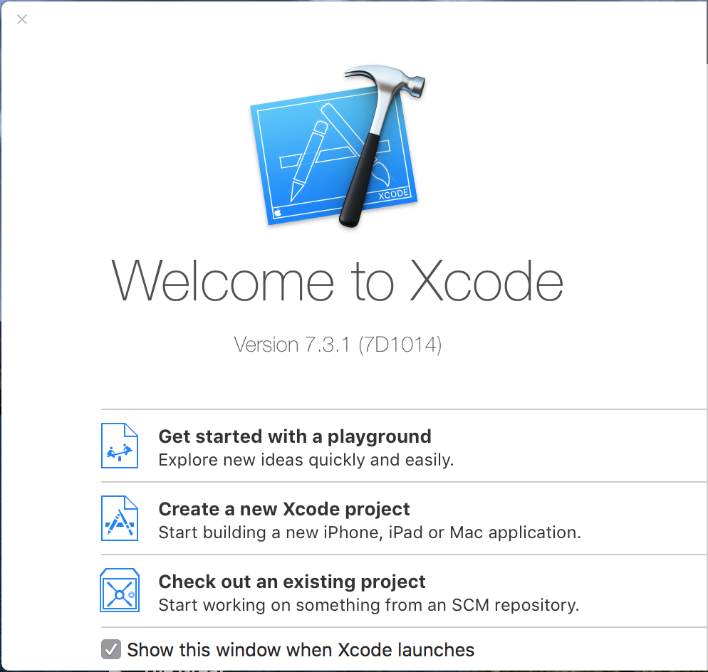
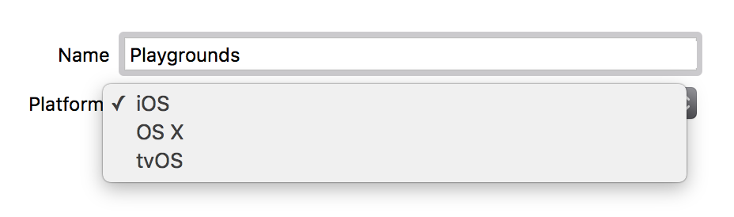
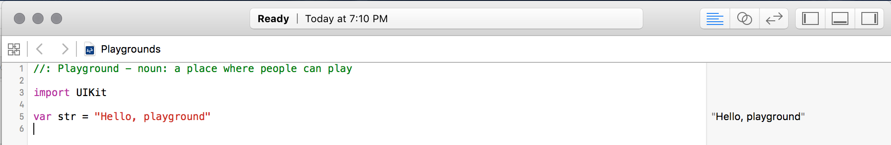
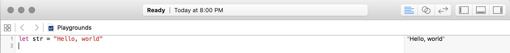
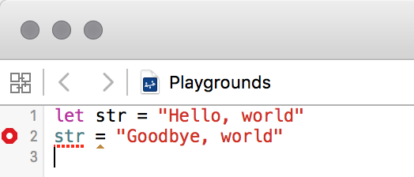
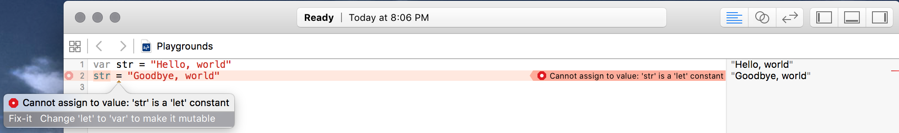

# Playgrounds

## Learning Objectives

* Create a new playground file using Xcode.
* Explain that a playground file is not **necessary** to application projects. It's used solely as a place to explore, without the need to create a project.
* Write code in the playground file
* Be familiar with the error message that appears when trying to change a **let** constant.

## What the student can do at this point 

* Create variables & constants using `String` literals.

## Playgrounds

Apple provides an excellent tool for experimenting with Swift: Playgrounds. Playgrounds offer you a scratchpad for testing out Swift code. You can not only see the results of code as you type them in, but you can gain insight on what exactly is being executed by various bits of Swift code. Best of all, the tool is free and is a part of Apple's Xcode programming suite.

Playgrounds ships as part of Xcode, so the first thing you must do is download Xcode. You will need a Mac to run Xcode, as it does not run on iOS or Windows PCs. You can download Xcode from the [App Store](https://itunes.apple.com/us/app/xcode/id497799835?mt=12) on OS X.

Once Xcode has been downloaded, open it up from the Applications folder or launcher. You will be greeted by the following splash screen. Click "Get started with a playground" to create a new playground and experiment with some Swift code.

After clicking on "Get started with a playground", you will be prompted to name your new playground file. Give it a memorable name.

You can also select the programming environment you want to experiment with: iOS, OS X, or tvOS. Different environments offer slightly different options for interacting with the underlying system; for example, iOS provides the Cocoa Touch framework, whereas OS X provides the Cocoa framework. For now, the code you are writing will not depend on any specific platform, so you can select "iOS".

Click "Next" to continue. You will be prompted to save your new playground file somewhere on your computer. Save it anywhere you like and click "Create" to finish setting up your new playground. You will see a mostly empty document like the one below.

## Experimenting With Code

By default, your new playground will include a line importing UIKit (`import UIKit`) and the declaration of a string variable called `str`. You can erase the contents of the playground; for now, you won't be experimenting with any UIKit features.

You can write any Swift code you want in the playground file. As you enter each line, you will see the results of executing that line of code in the grey sidebar on the right side of the playground. Try declaring a constant called `str` and setting it to `"Hello, world!"`. You should see the following in the playground file:

Since you declared `str` to be a _constant_, try changing its value on the second line of the playground file. Notice that instead of executing that line of code and showing its output in the sidebar, Xcode instead highlights it as an error:

If you click on the red circle to the left of the erroneous line of code, Xcode will tell you why the line was marked as an error, and even provides a suggestion on how to fix it:

Do you know why Xcode marked it as an error?

Don't worry about fixing the error right now. Just be aware that this is how Xcode will show you lines of Swift code that won't work, and show you one way to fix them so they do work. It might not always be the most correct way to fix code, though!

That's all you need to know about playgrounds for now, but you'll be making extensive use of them as you progress through your Swift studies. For more information, feel free to read Apple's documentation on [playgrounds](https://developer.apple.com/library/ios/recipes/Playground_Help/Chapters/CreateAndEdit.html#//apple_ref/doc/uid/TP40015166-CH36-SW1).

<a href='https://learn.co/lessons/PlayGrounds' data-visibility='hidden'>View this lesson on Learn.co</a>
